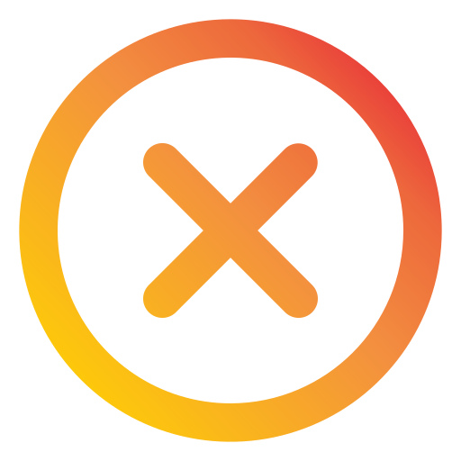

# Compass Uol Final Project

## Você pode testar este projeto no seu navegador!
### Acesse https://compass-uol-final-project.vercel.app/
 
Projeto final da Compass.uol, no qual devemos replicar o modelo apresentado no Figma:
https://www.figma.com/file/D9NUCsGJ1gCvmL0ZUnb7SJ/keepalive?node-id=0%3A1

## Ferramentas Utilizadas:
##### React
##### NodeJs
##### TypeScript
##### ESlint
##### HTML5, CSS3, JS``
##### CSS Modules
##### React Router
##### VSCode
##### Figma
  

## Resultados

Mobile:

https://user-images.githubusercontent.com/63110149/180589134-ac12cfc5-3990-4cc2-880e-7049cf6596a8.mp4

Desktop:

 

## Créditos
#### Créditos aos autores dos vetores utilizados no projeto:

####  - [Febrian Hidayat](https://www.flaticon.com/br/autores/febrian-hidayat)
####  - [Ilham Fitrotul Hayat](https://www.flaticon.com/br/autores/ilham-fitrotul-hayat)

## Info

Este projeto foi feito com [Create React App](https://github.com/facebook/create-react-app).
Documentação React: [React documentation](https://reactjs.org/).
